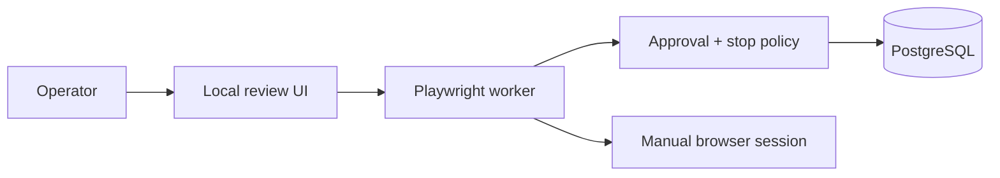

# Portfolio overview

## Architecture

## Core flow

1. A local workflow prepares a message, but does not send it.
2. An operator reviews the specific profile and content.
3. One-time approval checks duplicates and the emergency stop before any browser action.

## Visual walkthrough

The public synthetic demo is hosted at https://jhonwictordev.github.io/instagram-prospecting-agent/ and never connects to Instagram.

## Environment and data

Use .env.example, a dedicated browser profile and local PostgreSQL. No Instagram password, cookie or production account is stored in this project.

## Decisions

- Human approval is the default mode; automatic sending requires multiple safeguards.
- Platform interventions stop execution rather than triggering bypass behavior.
- The emergency stop can be activated at runtime without restarting the worker.
